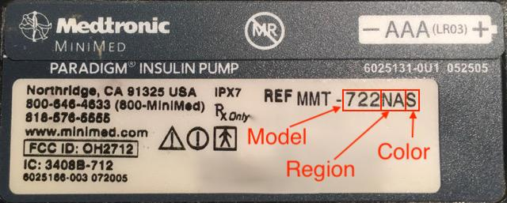
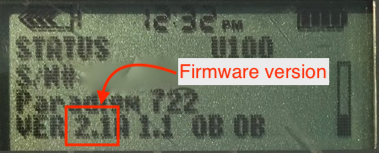

# Insulin Pump


There are a number of insulin pumps manufactured between 2006 – 2012 by Medtronic which are compatible.  Compatibility has two requirements; (1) pump model and (2) firmware.

!!!info ""
    <u>LOOP COMPATIBLE PUMPS:</u>  The 515/715 and 522/722 pumps are all compatible.  The 523/723 and 554/754 pumps will require you to check the firmware to see if the pump is Loop compatible.  See the footnotes 3 and 4 for the required firmwares.
    
    <u>LOOP **NOT** COMPATIBLE PUMPS:</u>  The 512/712 pumps are **NOT** compatible with Loop system (you can run a limited OpenAPS setup on a 512/712, however).  The Omnipod, Animas, T-slim, Medtronic 600 series and any other name of pump that you wish to insert are also **NOT** compatible.  Work is being done to make Omnipod work with Loop, but there is no predicted timeline for that.  Believe me...when it happens we will update and announce.

<table>
  <thead>
    <tr>
      <td colspan="2" rowspan="4"></td>
      <th colspan="4">Insulin Pump</th>
    </tr>
    <tr>
      <th>MM 515/715</th>
      <th>MM 522/722<sup><a href="#hw3">2</a></sup></th>
      <th>MM 523/723<sup><a href="#hw3">3</a></sup></th>
      <th>MM 554/754<sup><a href="#hw3">4</a></sup></th>
    </tr>
  </thead>
  <tbody>
    <tr>
      <th rowspan="4">CGM</th>
      <th>Dexcom G4<sup><a href="#hw1">1</a> </sup></th>
      <td>✅</td>
      <td>✅</td>
      <td>✅</td>
      <td>✅</td>
    </tr>
    <tr>
      <th>Dexcom G5</th>
      <td>✅</td>
      <td>✅</td>
      <td>✅</td>
      <td>✅</td>
    </tr>
    <tr>
      <th>MM CGM</th>
      <td>✅</td>
      <td>✅</td>
      <td>✅</td>
      <td>✅</td>
    </tr>
  </tbody>
</table>

<br/><a name="hw1">1</a>. Offline access to glucose requires a Receiver with Share and the [Share2 app](https://itunes.apple.com/us/app/dexcom-share2/id834775275?mt=8) to be running on the same iPhone as the Loop app is installed. Internet-dependent access via Share servers is also supported.
<br/><a name="hw2">2</a>. x22 model pumps were produced before firmware security patches were implemented, therefore these models are compatible because they will have firmware 2.4A or lower only.  You can double check, but thus far all x22 pumps we have seen have compatible firmware.
<br/><a name="hw2">3</a>. Firmware 2.4A or lower is required for using Closed Loop and Bolus features.
<br/><a name="hw3">4</a>. Worldwide Veo (2.6A or lower) or Canadian/Australian Veo (2.7A or lower) is required for using Closed Loop and Bolus features. US version of this pump is not available.

*****************************
If you want to triple check compatibility, you can check for presence/absence of "PC connect" in the pump.  If PC Connect is present, then the pump is NOT compatible.  You can find PC connect in the Medtronic's Main Menu, Utilities, Connect Devices.  PC Connect, if present, will be the first option showing in that menu, above the word "Meters".  If you do **NOT** see PC Connect there...good!

<p align="center">

</p>
*****************************

## Pump Model

To determine your pump model, look at the back side of your pump.  There should be a sticker on the underside of the pump.  On the right hand side of the sticker, it says REF MMT-XXXXXX



```
    MMT       Pump Manufacturer Model (MiniMed Medtronic)
    722       Pump Model Number
    NA        Pump Region (NA=North America, CA=Canada/Australia, WW=Worldwide)
    S         Pump Color (S=Smoke, L=Clear/Lucite, B=Blue, P=Pink/Purple)
```

Some pumps may have an “L” or “S” or "R" before the pump region, e.g. a model number like MMT-722LNAS.  This does not affect Loop compatibility.


## Pump Differences
The  differences between the pump models are limited.

<font color ="orange">500 vs 700</font>:  The difference between the Medtronic 500 series and the 700 series pumps is the size of the insulin reservoirs.  The 500 series pumps use a 180 unit reservoir, and the 700 series pumps use a 300 unit reservoir (or smaller 180 unit reservoir, if you want).

<font color ="orange">x15/x22 vs x23/x54</font>:  The difference between the x15 and x22 pumps versus the x23 and x54 series pumps has only a few notable mentions:

* The x23/x54 pumps will allow for smaller insulin deliveries in certain situations, if the smaller scroll rate is selected in the Bolus>Setup>Scroll Rate menu.  **Loop will have the insulin delivery automatically rounded by the pump to the units available in the pump model, and any smaller adjustments (to make up for the rounding) will be made through Loop’s use of temp basals.  If you want the smaller increments of basal rates, you can still enter those values in Loop app's settings and Loop will use those values for the purposes of insulin delivery calculations.**

<table>
<thead>
<tr>
<th>Pump Model</th>
<th>Basal increments</th>
<th>Bolus increments</th>
<th>Range</th>
</tr>
</thead>
<tbody>
<tr>
<th>515/715</br>and</br>522/722</th>
<td>0.05</br>0.1</td>
<td>0.1</br>0.1</td>
<td>deliveries less than 10 units</br>greater than 10 units</td>
</tr>
<tr>
<th>523/723</br>and</br>554/754</th>
<td>0.025</br>0.05</br>0.1</td>
<td>0.025 </br>0.05 </br>0.1</td>
<td>between 0.025 to 0.975 units</br>between 1 to 9.95 units</br>greater than 10 units</td>
</tr>
</tbody>
</table>

* Additionally, because of the way Loop fetches information from the pump, the x23/x54 series of pumps are slightly better at conserving battery life through the use of the MySentry packets to collect information from the pump.  x22 pumps do not use MySentry.

* The x23/x54 series pumps are also faster at delivering boluses greater than 10 units.  On an x23 pump, a 13-unit bolus takes 5:00 minutes to complete.  On an x22 pump, a 13-unit bolus takes 8:40 minutes to complete.

## Pump Firmware

!!!info ""
    If you are looking to use a 523/723 or 554/754 pump, you will need to check the firmware version for compatibility.

A pump’s firmware is the internal software that runs your pump.  Older Medtronic firmware allows Loop to act as a “remote control” to set temp basals and report back pump data.  Newer firmware disabled that “remote control” access and therefore cannot be used with these DIY closed-loop systems.  There is currently no ability to downgrade a pump’s firmware or replace it with older firmware.  Before you buy a used pump, make sure you are getting one with compatible firmware.

To find your pump’s firmware you will need to power it up.  If the pump has not been powered on for some time (i.e., has been in storage without a battery for awhile), it will run through a start-up count and the firmware version will appear on the bottom right of the pump’s screen.  Don’t turn away, as the version number will only be displayed for a little while before the screen moves onto other information displays.  

If the pump has been active recently or has a reservoir installed, follow these steps:

1. Press the  button on your pump.  

1. Scroll down with the  button to the bottom of the status display.  

1. Read the bottom line of the display.



## Other pumps

While we all would love to have our {insert your favorite manufacturer} pump be compatible with a DIY closed-loop system like Loop, unfortunately it just isn't possible right now.  There are efforts being made to crack the software code on other pumps (like Animas and Omnipod), and when they are successful...believe me...we will tell you about it!

## Finding a Medtronic pump

Finding a compatible Medtronic pump is probably the most difficult part for most new Loopers.  Our suggestion:

* Talk to friends in the diabetic community.

* Ask your endocrinologist.  

* Ask at a local JDRF chapter meeting if someone has an old backup pump they'd be willing to donate to you.  

* Join diabetic supply groups in Facebook; both for-trade and for-sale groups.  

* Check Craigslist often and be willing to expand your search area to include larger cities.

* Check out the **HelpAround, NextDoor, OfferUp, and/or LetGo** apps for pumps.

* Search [Medwow](http://medwow.com) for used Medtronic pumps

Medwow has been fairly frustrating for most people; poor response rate, high prices.  The most success appears to come from either one-on-one discussions with fellow diabetics/doctors or using apps (Craigslist, NextDoor, LetGo, HelpAround).  If you are using Craigslist, you may wish to use an app on your iPhone to make the searching easier.  There are apps to search multiple cities at one for your keywords and set up alerts.


## Safe Purchasing

If you choose to purchase from a remote or unknown seller, here are some tips for safe purchasing:

* Use Paypal and purchase using the "Goods and Services" payment option.  This costs nothing for the buyer, but the seller will lose 2.95% of the sale to Paypal fees.  Paypal offers some protection for both buyer and seller in the event of fraud.  

* Ask for photos of the pump.  Check to make sure the serial number of the pump on the backside matches the serial number of the pump showing in the display menu.  Ask for a short video of the pump, or at least a photo of the pump turned on, so that you can see the pump's firmware and model number.  Cracks and some wear on these pumps is expected...these pumps are not usually free of any marks.  Many people are successfully looping on pumps that have cracks and rub marks...but you may want to ask if you are concerned about any you see.  

* Ask for shipping that includes a tracking number.  USPS Priority Mail's smallest box is a great option.  It's only $7.15 and includes tracking.  Ask the seller to add a small bit of packing protection such as bubble wrap around the pump to keep it safe during shipping.  Make sure you get a tracking number within a reasonable period of time after you have paid.  

Red flags that may indicate a scam:

* Asking for payment through "friends and family" on Paypal, especially if you don't know the person or have any solid references for them.  Paying in that way offers you no buyer protection.  It's just like giving the seller cash, so you had better trust the seller.  

* Offering an "almost new" pump is a big red flag.  These pumps should be at least 5 years old by now.  Do you really think a 5 year old pump should be unused and sitting in shrink wrap at this point?  Seems highly suspicious.  

* Not able to provide new pictures of the pump when requested.  Sure they posted some pictures with the ad, but what if they just downloaded them from other people's ads?  The seller should be able to furnish a couple "new" photos are your request.  A good one to ask for is the battery and reservoir tops so you can see the condition of those.

## Pump Supplies

Medtronic will not typically want to sell pump supplies directly to customers who do not have an in-warranty Medtronic pump registered in their system.  Ask your insurance about purchasing pump supplies through a durable medical equipment (DME) provider.  If you are brand new to Medtronic infusion sites, you may want to ask for help from friends to try a variety of infusion sets before purchasing a full 90-day supply of any in particular.
